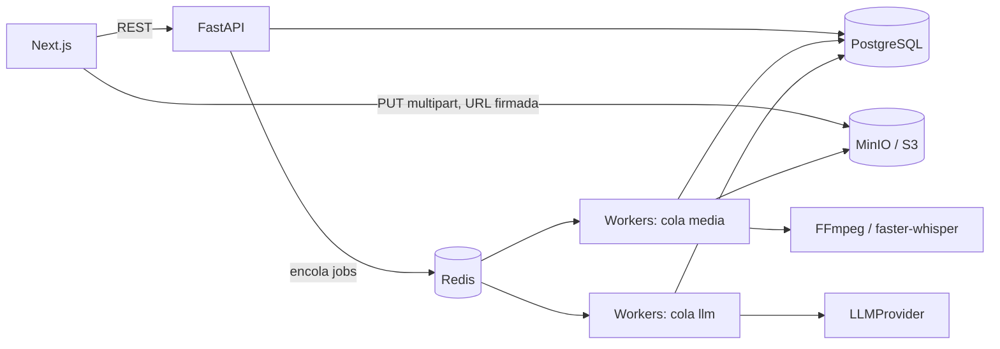

# ReelForge

App web que convierte videos largos (podcasts, entrevistas, clases, streams) en clips verticales 9:16 para Reels, TikTok y YouTube Shorts, usando IA para detectar los mejores momentos.

> **Estado:** Etapa 1 completada (arquitectura, estructura, base de datos y API). Ver [Roadmap](#roadmap).

---

## Alcance del MVP

Subir video → transcribir → detectar highlights → cortar a 9:16 → subtítulos → ajustar inicio/fin → exportar MP4.

Queda fuera del MVP, pero preparado como adaptador o interfaz: B-roll con IA, auto zoom sofisticado, face/speaker tracking, importación desde URL (YouTube, Drive), 4K.

**Regla de trabajo:** no se usan datos falsos para simular funciones. Lo que depende de un servicio externo va detrás de un adaptador, con las credenciales en `.env`.

---

## Stack

| Capa | Tecnología |
|---|---|
| Frontend | Next.js, React, TypeScript, Tailwind CSS |
| API | FastAPI (Python) |
| Base de datos | PostgreSQL |
| Storage | MinIO (compatible con S3) |
| Cola y workers | Celery + Redis |
| Procesamiento de video | FFmpeg / ffprobe |
| Transcripción | faster-whisper (local), intercambiable |
| Análisis semántico | LLM vía API (implementación inicial: Anthropic) |

---

## Arquitectura



### Decisiones técnicas

- **Subida directa a MinIO.** El navegador sube el video con URLs firmadas multipart. La API no procesa archivos pesados, solo inicia y completa la subida.
- **Celery + Redis.** Reintentos y encadenado de tareas ya resueltos. Dos colas: `media` (FFmpeg, Whisper) y `llm`, para escalar cada una por separado.
- **Transcripción local con faster-whisper**, con timestamps por palabra. Está detrás de la interfaz `TranscriptionProvider`, así que se puede cambiar por una API externa.
- **`LLMProvider`** como interfaz, con implementación inicial para Anthropic. Las credenciales van en `.env`.
- **Jobs idempotentes.** Cada etapa guarda su resultado y se salta si ya existe, para tolerar reintentos y fallos parciales.
- **Preview en el editor sin render.** Se reproduce el video original entre `start` y `end` con un recorte 9:16 en CSS. Solo el render final usa FFmpeg.
- **Reframe del MVP:** recorte centrado. El face tracking llega después, detrás de la interfaz `Reframer`.
- **Scores como heurísticos.** Las métricas de cada highlight (hook, claridad, emoción, etc.) son indicadores para ayudar a elegir, no una predicción de viralidad.

---

## Pipeline de procesamiento (MVP)

| # | Etapa | Dónde |
|---|---|---|
| 1 | Upload multipart a MinIO | Frontend → MinIO |
| 2 | `ffprobe`: duración, resolución, tamaño | Worker `media` |
| 3 | Extraer audio a 16 kHz mono | Worker `media` |
| 4 | Transcripción con timestamps por palabra | Worker `media` |
| 5 | Detección de silencios | Worker `media` |
| 6 | El LLM propone highlights con título, motivo, categoría y scores | Worker `llm` |
| 7 | Ajuste de bordes a fin de frase o silencio | Worker `media` |
| 8 | Generación de subtítulos (ASS) | Worker `media` |
| 9 | Render 9:16 con FFmpeg | Worker `media` |
| 10 | MP4 final a MinIO y URL firmada de descarga | Worker + API |

**Frontend:** subida, dashboard, tarjetas de highlights, editor (preview, inicio/fin, estilo de subtítulos), progreso de render.
**Backend:** todo el procesamiento, la persistencia y las URLs firmadas.

---

## Estructura de carpetas

```
reelforge/
├─ apps/
│  ├─ web/                    # Next.js
│  │  ├─ app/
│  │  ├─ components/
│  │  └─ lib/api/
│  └─ api/
│     ├─ app/
│     │  ├─ routers/
│     │  ├─ models/
│     │  ├─ schemas/
│     │  └─ services/
│     ├─ workers/
│     │  ├─ tasks/
│     │  ├─ pipeline/
│     │  └─ ffmpeg/
│     └─ providers/
│        ├─ transcription/
│        ├─ llm/
│        ├─ reframe/
│        └─ broll/
├─ infra/
│  ├─ docker-compose.yml
│  └─ .env.example
└─ docs/
```

---

## Modelo de datos

| Tabla | Campos principales |
|---|---|
| `users` | id, email, plan |
| `projects` | id, user_id, name, status |
| `videos` | id, project_id, s3_key, duration, width, height, size |
| `transcripts` | id, video_id, language, status |
| `transcript_segments` | id, transcript_id, start, end, text, speaker_id, words (jsonb) |
| `speakers` | id, transcript_id, label |
| `highlights` | id, video_id, start, end, title, reason, scores (jsonb), category |
| `clips` | id, project_id, highlight_id, start, end, preset, status |
| `captions` | id, clip_id, style (jsonb), words (jsonb) |
| `edits` | id, clip_id, type, params (jsonb) |
| `render_jobs` | id, clip_id, aspect, resolution, status, progress, error, attempts |
| `exports` | id, render_job_id, s3_key, size, expires_at |

**Relaciones:** `users 1─N projects 1─N videos 1─1 transcripts 1─N transcript_segments`; `videos 1─N highlights`; `highlights 1─N clips`; `clips 1─1 captions`, `clips 1─N edits`, `clips 1─N render_jobs 1─N exports`.

**Estados de procesamiento:** `uploading`, `transcribing`, `analyzing`, `finding_highlights`, `generating_captions`, `ready`, `rendering`, `completed`, `error`.

---

## API (REST)

| Método | Endpoint | Descripción |
|---|---|---|
| POST | `/projects` | Crear proyecto |
| GET | `/projects` | Listar proyectos |
| GET | `/projects/{id}` | Detalle de proyecto |
| POST | `/projects/{id}/uploads` | Iniciar subida multipart |
| POST | `/uploads/{id}/complete` | Completar subida y disparar el pipeline |
| GET | `/projects/{id}/status` | Estado del procesamiento |
| GET | `/videos/{id}/transcript` | Transcripción con timestamps |
| GET | `/videos/{id}/highlights` | Highlights detectados |
| POST | `/clips` | Crear clip desde un highlight o timestamps |
| PATCH | `/clips/{id}` | Modificar inicio, fin o preset |
| POST | `/clips/{id}/captions` | Generar subtítulos |
| POST | `/clips/{id}/render` | Encolar render |
| GET | `/renders/{id}` | Estado y progreso del render |
| GET | `/exports/{id}/download` | URL firmada de descarga |

---

## Producción: puntos a cubrir

- Uploads multipart con reintento por parte y validación de tipo y tamaño.
- URLs firmadas con expiración para subida y descarga.
- Límites por usuario (duración, tamaño, cantidad de renders) según el `plan`.
- Jobs idempotentes, con reintentos acotados y registro de errores parciales.
- Eventos o webhooks al terminar cada etapa.
- Control de costos: límite de tokens por video y caché de resultados del LLM.
- Limpieza de archivos temporales y expiración de exports (`expires_at`).
- Monitoreo de colas y workers.

---

## Roadmap

- [x] **Etapa 1:** arquitectura, carpetas, base de datos y API.
- [ ] **Etapa 2:** backend y pipeline con FFmpeg.
- [ ] **Etapa 3:** frontend (dashboard, resultados, editor).
- [ ] **Etapa 4:** integración, `docker-compose` e instrucciones para correr local.
- [ ] **Después del MVP:** face y speaker tracking, Smart Cut, Auto Zoom, AI B-Roll, hooks y copy, presets, 1:1 y 16:9, 4K.

---

## Credenciales

Todas las claves van en `infra/.env` (a partir de `infra/.env.example`, que se completará en la etapa 4). **Nunca subas `.env` a GitHub.** Necesitarás como mínimo una clave de un proveedor LLM.
